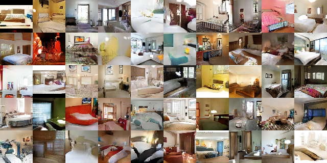
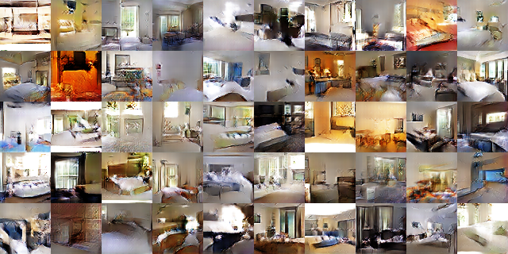
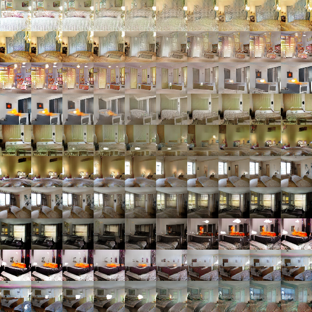
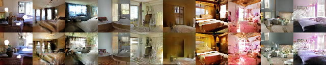
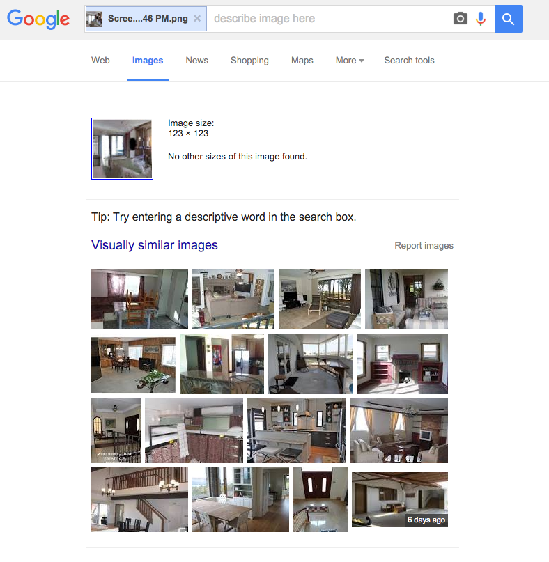
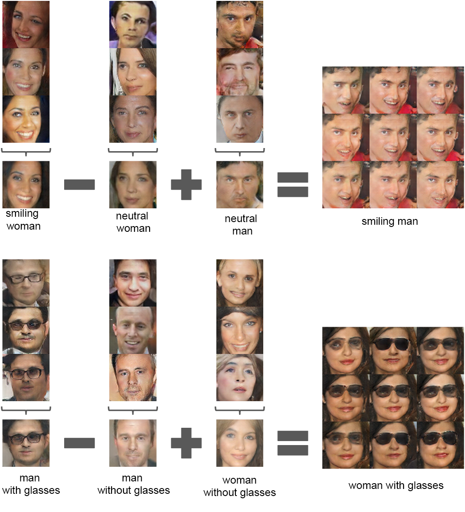
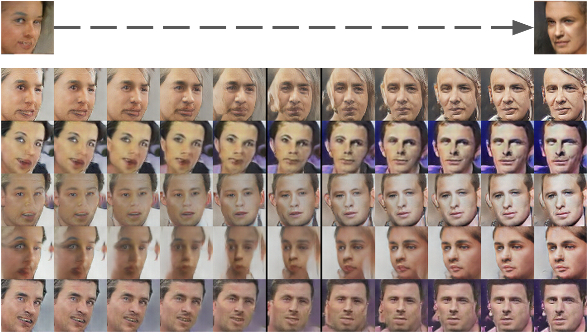
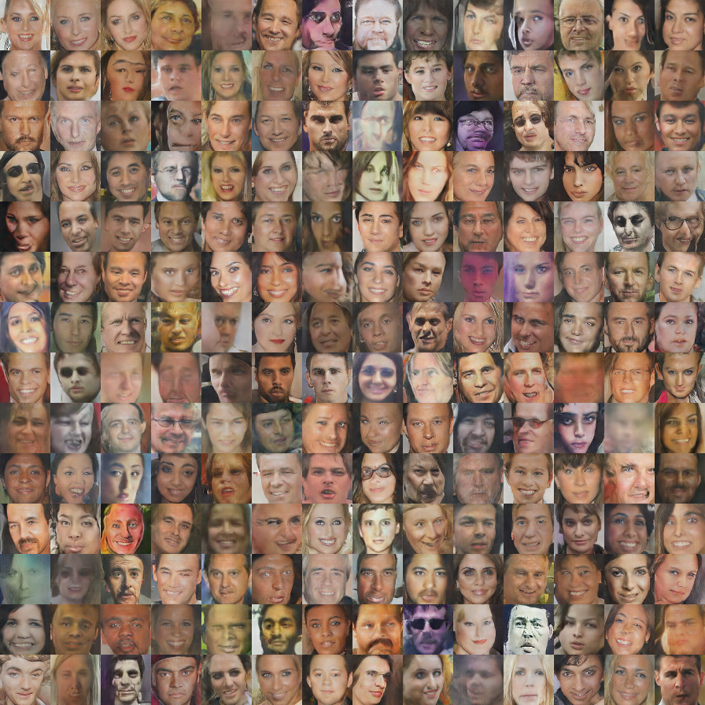
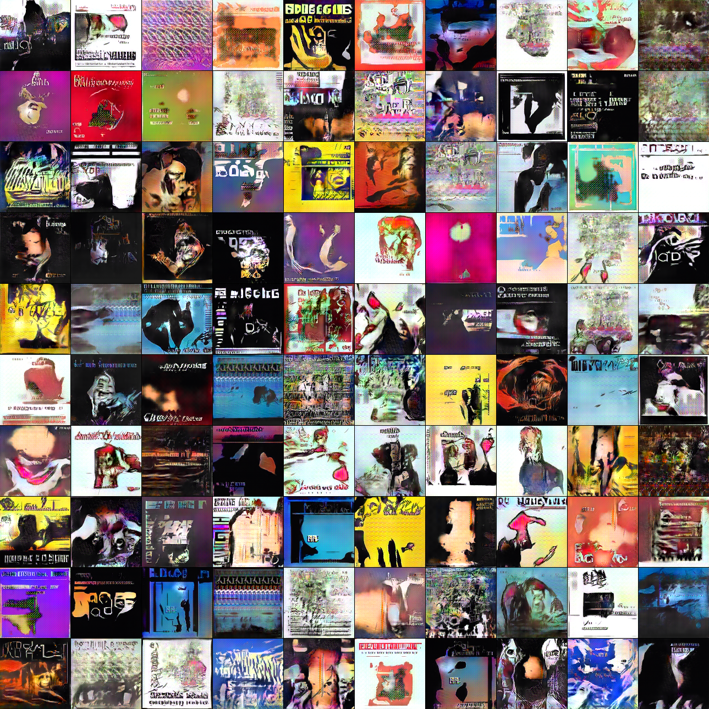
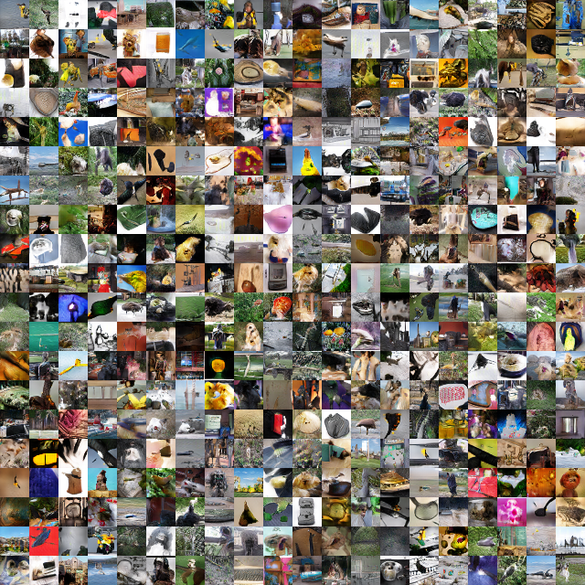

# Unsupervised Representation Learning with Deep Convolutional Generative Adversarial Networks
## [Alec Radford]((https://github.com/newmu)), [Luke Metz](https://github.com/lukemetz), [Soumith Chintala](https://github.com/soumith)

All images in this paper are generated by a neural network. They are NOT REAL.

Full paper here: [http://arxiv.org/abs/1511.06434](http://arxiv.org/abs/1511.06434)

###Other implementations of DCGAN
* [Torch](https://github.com/soumith/dcgan.torch)
* [Chainer](https://github.com/mattya/chainer-DCGAN)
* [TensorFlow](https://github.com/carpedm20/DCGAN-tensorflow)

##Summary of DCGAN
We 
- stabilize Generative Adversarial networks with some architectural constraints
  - Replace any pooling layers with strided convolutions (discriminator) and fractional-strided
convolutions (generator).
  - Use batchnorm in both the generator and the discriminator
  - Remove fully connected hidden layers for deeper architectures. Just use average pooling at the end.
  - Use ReLU activation in generator for all layers except for the output, which uses Tanh.
  - Use LeakyReLU activation in the discriminator for all layers.
- use the discriminator as a pre-trained net for CIFAR-10 classification and show pretty decent results.
- generate really cool bedroom images that look super real
- To convince you that the network is not cheating:
  - show the interpolated latent space, where transitions are really smooth and every image in the latent space is a bedroom.
  - show bedrooms after one epoch of training (with a 0.0002 learning rate), come on the network cant really memorize at this stage.
- To explore what the representations that the network learnt,
  - show deconvolution over the filters, to show that maximal activations occur at objects like windows and beds
  - figure out a way to identify and remove filters that draw windows in generation. 
    - Now you can control the generator to not output certain objects.
- Because we are tripping
  - Smiling woman - neutral woman + neutral man = Smiling man. Whuttttt!
  - man with glasses - man without glasses + woman without glasses = woman with glasses. Omg!!!!
- learnt a latent space in a completely unsupervised fashion where ROTATIONS ARE LINEAR in this latent space. WHHHAAATT????!!!!!!
- Figure 11, trained on imagenet has a plane with bird legs. so cooool.

# Bedrooms after 5 epochs
Generated bedrooms after five epochs of training. There appears to be evidence of visual
under-fitting via repeated textures across multiple samples.

# Bedrooms after 1 epoch
Generated bedrooms after one training pass through the dataset. Theoretically, the model
could learn to memorize training examples, but this is experimentally unlikely as we train with a
small learning rate and minibatch SGD. We are aware of no prior empirical evidence demonstrating
memorization with SGD and a small learning rate in only one epoch.

# Walking from one point to another in bedroom latent space

Interpolation between a series of 9 random points in Z show that the space
learned has smooth transitions, with every image in the space plausibly looking like a bedroom. In
the 6th row, you see a room without a window slowly transforming into a room with a giant window.
In the 10th row, you see what appears to be a TV slowly being transformed into a window.

# Forgetting to draw windows

Top row: un-modified samples from model. Bottom row: the same samples generated
with dropping out ”window” filters. Some windows are removed, others are transformed into objects
with similar visual appearance such as doors and mirrors. Although visual quality decreased, overall
scene composition stayed similar, suggesting the generator has done a good job disentangling scene
representation from object representation. Extended experiments could be done to remove other
objects from the image and modify the objects the generator draws.

# Google image search from generations

# Arithmetic on faces

# Rotations are linear in latent space

# More faces

# Album covers

# Imagenet generations

